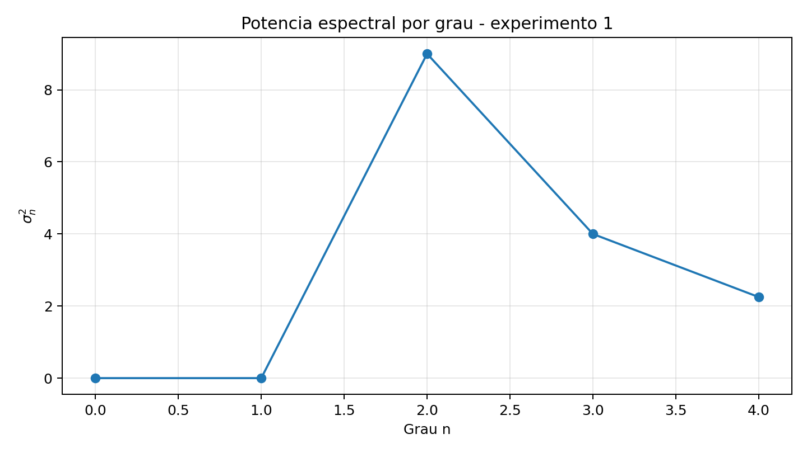
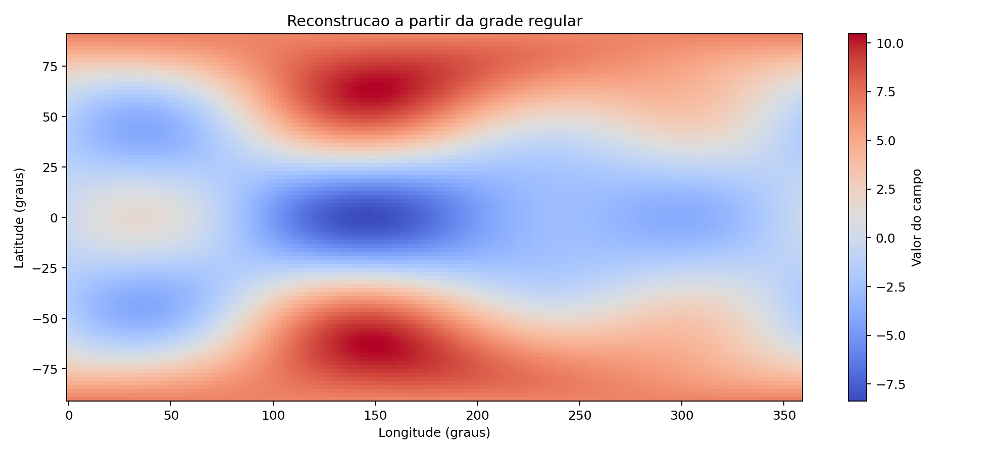

# Projeto 1: Analise Espectral em Harmonicos Esfericos

Implementacao computacional do Projeto 1 da disciplina de Geodesia Fisica / Metodos Numericos, com foco em decomposicao espectral de campos definidos sobre a esfera por meio de harmonicos esfericos reais.

O projeto cobre os experimentos propostos no enunciado, incluindo recuperacao de coeficientes em grade regular, ajuste a partir de observacoes irregulares, analise da potencia espectral por grau e tarefas adicionais de reconstrucao, truncamento espectral, comparacao de normalizacoes e uso de coeficientes geopotenciais reais.

## Destaques

- Recuperacao numerica de coeficientes harmonicos de um campo sintetico em grade global regular
- Ajuste por minimos quadrados com pontos distribuidos irregularmente na esfera
- Calculo e visualizacao da potencia espectral por grau
- Reconstrucao global do campo a partir dos coeficientes estimados
- Geracao de mapas truncados em diferentes graus
- Comparacao entre normalizacao Schmidt e fully normalized
- Aplicacao a um modelo geopotencial real no formato `.gfc`

## Estrutura do repositorio

```text
.
|-- README.md
|-- pixi.toml
|-- projeto1.pdf
|-- projeto1_solution.py
|-- relatorio_resultados.md
|-- data/
|   `-- HUST-Grace2020-n60-200301.gfc
`-- outputs/
    |-- comparacao_normalizacoes.png
    |-- mapa_campo_original.png
    |-- mapa_modelo_real_grau_12.png
    |-- mapa_reconstrucao_irregular.png
    |-- mapa_reconstrucao_regular.png
    |-- mapa_truncado_grau_2.png
    |-- mapa_truncado_grau_3.png
    |-- mapa_truncado_grau_4.png
    |-- potencia_grau_irregular.png
    |-- potencia_grau_modelo_real.png
    `-- potencia_grau_regular.png
```

## Metodologia

### 1. Grade global regular

Foi sintetizado um campo escalar na esfera a partir de coeficientes conhecidos e, em seguida, os coeficientes foram recuperados por integracao numerica sobre uma grade regular em latitude e longitude.

### 2. Pontos irregulares

Observacoes sinteticas foram amostradas aleatoriamente sobre a esfera e ajustadas por minimos quadrados usando uma matriz de projeto formada pelas bases harmonicas esfericas.

### 3. Espectro por grau

A energia espectral foi calculada por grau a partir da soma das contribuicoes dos coeficientes `Cnm` e `Snm`.

### 4. Tarefas adicionais

- Reconstrucao do campo com os coeficientes recuperados
- Mapas globais com truncamento em diferentes graus
- Comparacao entre as normalizacoes Schmidt e fully normalized
- Aplicacao a coeficientes reais do modelo `HUST-Grace2020-n60-200301.gfc`

## Ambiente e tecnologias

- Pixi
- Python 3.14.3
- NumPy
- SciPy
- Matplotlib

## Como executar

Este projeto usa `Pixi` para gerenciamento de ambiente e dependencias.

1. Instale o Pixi na sua maquina:

```bash
curl -fsSL https://pixi.sh/install.sh | sh
```

No Windows, voce tambem pode seguir as instrucoes oficiais em [pixi.sh](https://pixi.sh/latest/).

2. Instale o ambiente do projeto:

```bash
pixi install
```

3. Execute o script principal:

```bash
pixi run run
```

4. Consulte os resultados gerados:

- `relatorio_resultados.md` com sintese numerica dos experimentos
- pasta `outputs/` com mapas e graficos

## Arquivos de ambiente

- `pixi.toml`: declaracao do projeto, dependencias e tarefas
- `pixi.lock`: sera gerado no primeiro `pixi install` e deve ser versionado no repositorio

As tarefas configuradas atualmente sao:

- `pixi run run`
- `pixi run solve`

## Principais resultados

Os resultados obtidos mostram:

- Recuperacao precisa dos coeficientes sinteticos no experimento com observacoes irregulares
- Reconstrucao com erro baixo no experimento em grade regular
- Identificacao clara da distribuicao de energia nos graus esperados
- Integracao do fluxo completo com um modelo geopotencial real

O resumo numerico completo esta em `relatorio_resultados.md`.

## Exemplo de saidas

### Potencia espectral por grau



### Reconstrucao do campo em grade regular



## Fonte dos coeficientes reais

Os coeficientes geopotenciais reais utilizados neste repositorio foram obtidos do servico ICGEM/GFZ a partir do modelo:

- `HUST-Grace2020-n60-200301.gfc`

Referencia institucional:

- [ICGEM - International Centre for Global Earth Models](https://icgem.gfz-potsdam.de/)

## Autor e contexto

Este repositorio foi preparado como entrega academica para a disciplina de Geodesia Fisica / Metodos Numericos, com foco em implementacao pratica de tecnicas espectrais aplicadas a harmonicos esfericos.
